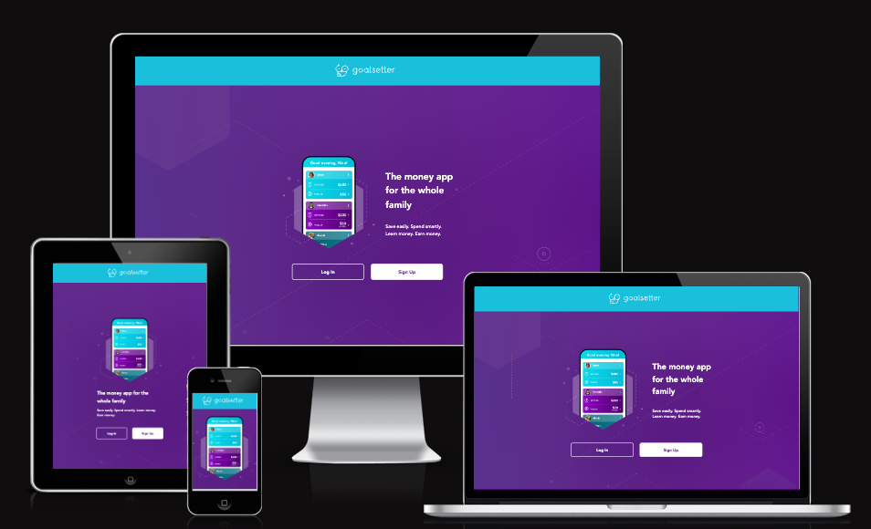

# MyApp

## Description
MyApp is a web application developed with Vite, a fast build tool for web applications. This application offers amazing features and is designed to enhance the user experience.

## Features
- Login page with responsive design.

## Installation
1. Clone the repository: `git clone https://github.com/leb90/challenge-goalsetter.co.git`
2. Install dependencies: `yarn install`

## Usage
- To run the application in development mode, use the following command: `yarn dev`
- To run the tests, use the following command: `yarn test`

## Challenge for Goalsetter.co
MyApp is a challenge project for Goalsetter.co. It showcases my skills and demonstrates my ability to develop a high-quality web application.

Feel free to explore and use MyApp as a reference or starting point for your own projects.

